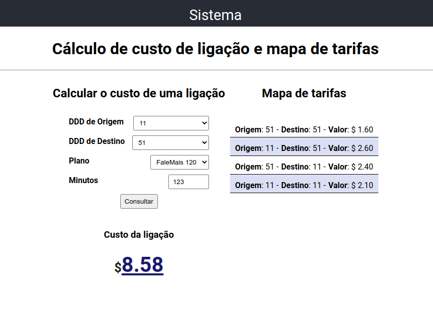

# Calling Tariff Challenge

Projeto desenvolvido com React.JS, React Hooks e Typescript.




## Instalação

**1 - Configurar o backend**

É preciso copiar o arquivo `.env-example` para `.env` e depois inserir a URL do backend na variável `REACT_APP_BACKEND_URL` do arquivo `.env`.

**2 - Instalar dependências**

Executar no terminal:

```shell script
npm i
```

**3 - Iniciar servidor de desenvolvimento**

Executar no terminal:

```shell script
npm start
```
